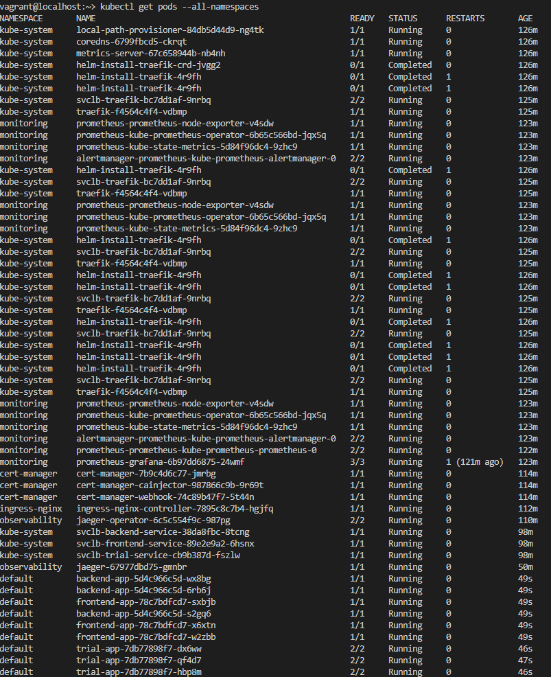
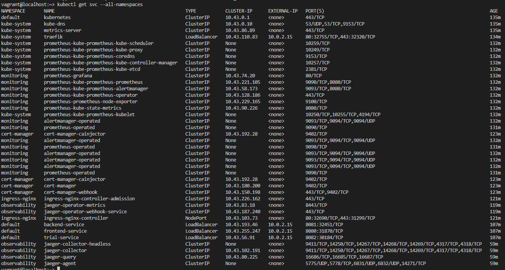
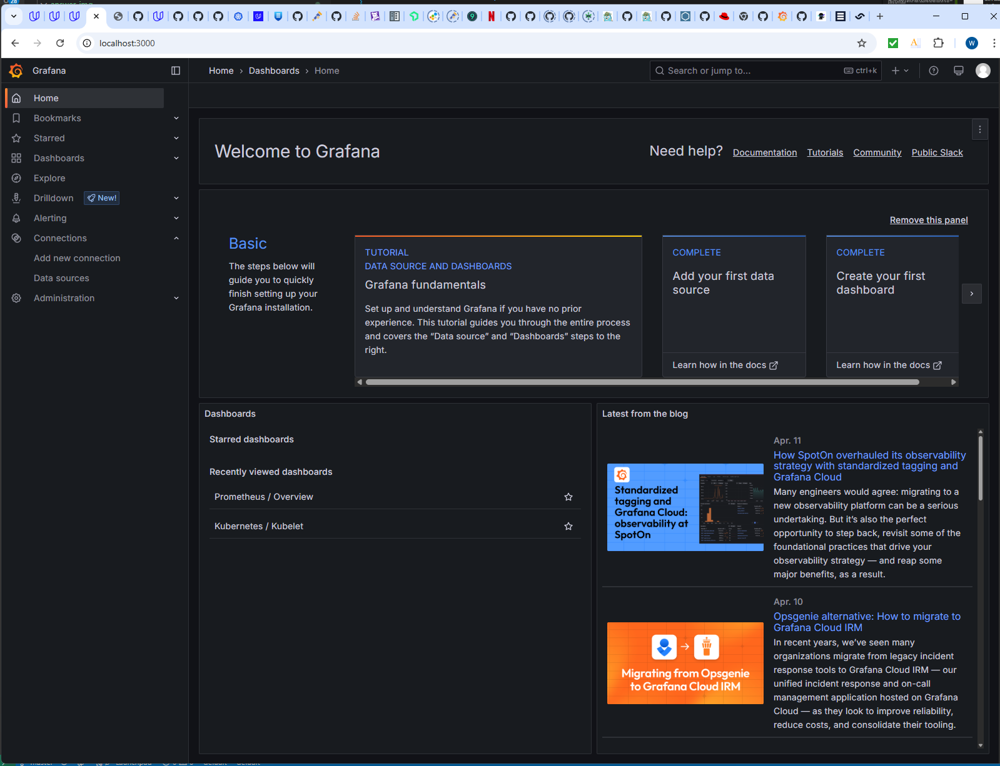
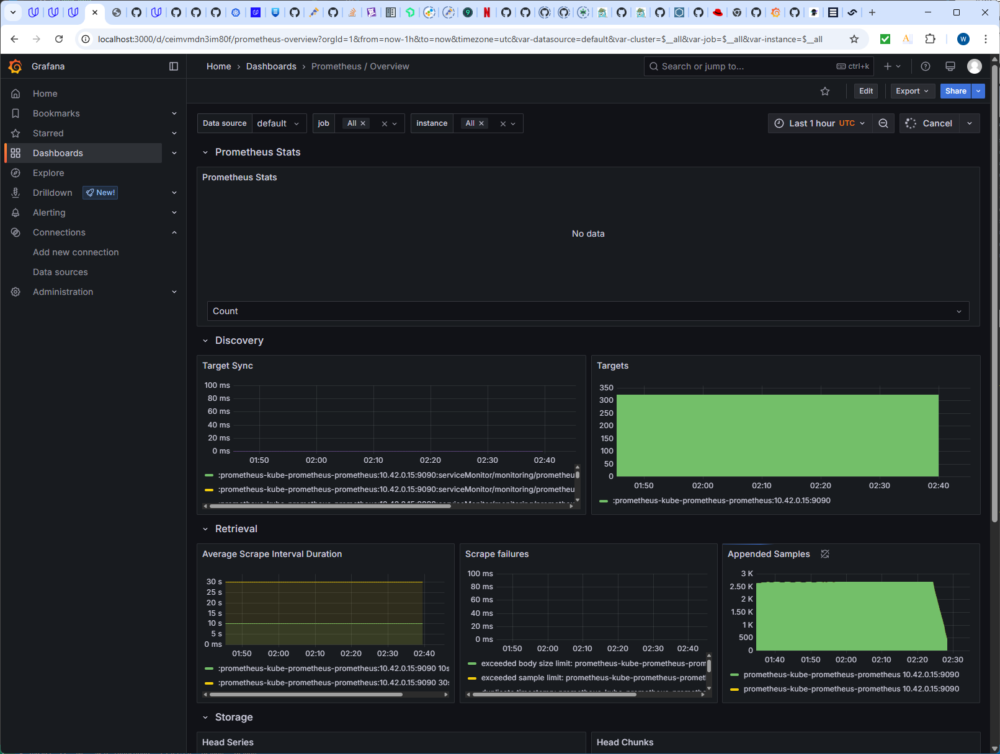
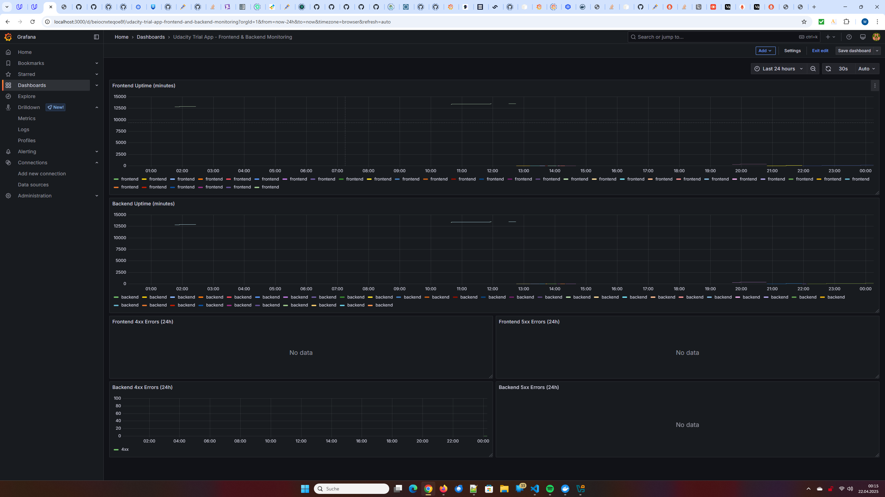
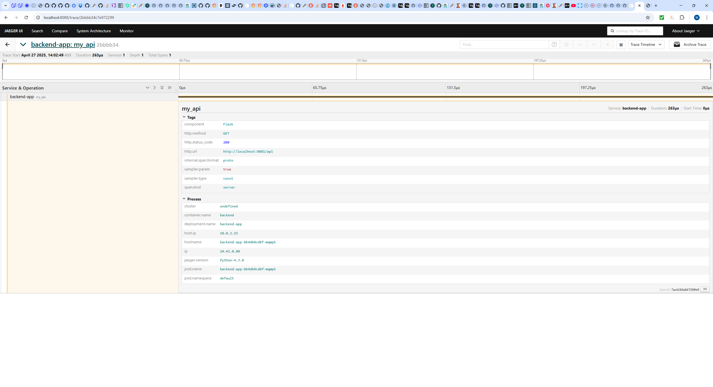
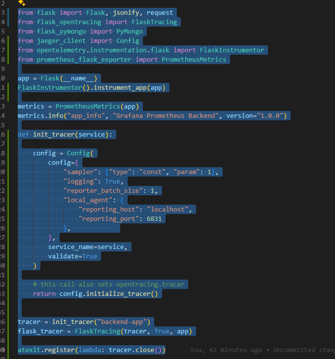
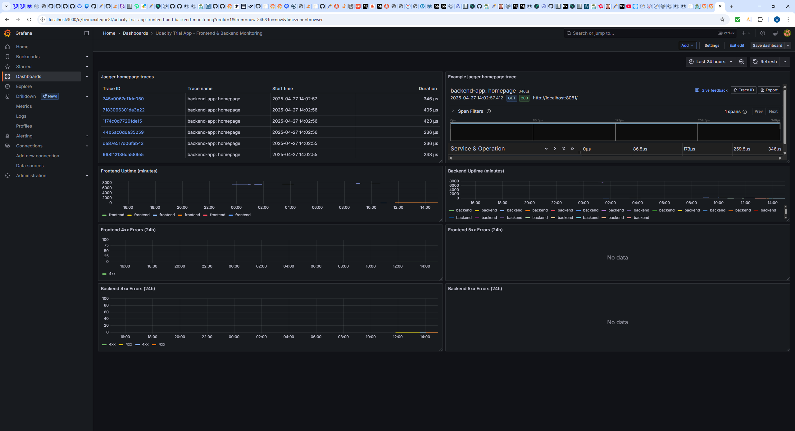
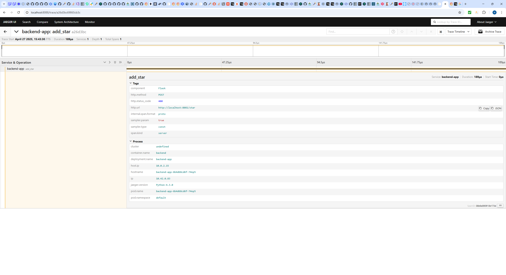
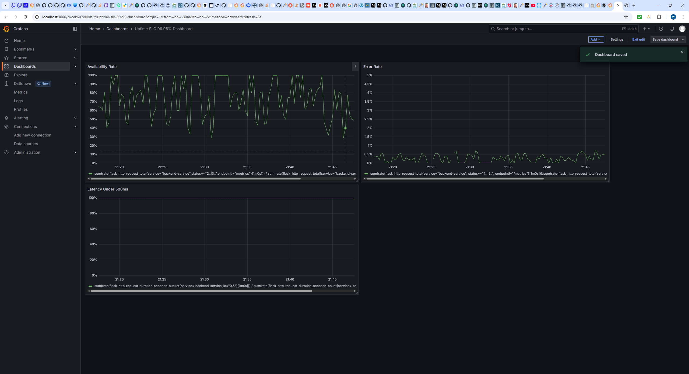

## Verify the monitoring installation

### All Pods in all Namespaces

### All Services in all Namespaces

## Setup the Jaeger and Prometheus source

Expose Grafana: 
`kubectl -n monitoring port-forward svc/prometheus-grafana --address 0.0.0.0 3000:80`
`Forwarding from 0.0.0.0:3000 -> 3000`

Add Prometheus as Datasource in Grafana:
`Grafana -> Connections -> Data Sources -> Add new Data Source -> Name: "Prometheus-Datasource" -> Connection - Prometheus Server URL: "http://prometheus-kube-prometheus-prometheus.monitoring.svc.cluster.local:9090" -> Save & test`

### Screenshot of the homepage after Login to Grafana

## Create a Basic Dashboard

## Describe SLO/SLI

SLO: "At least 99% of uptime per month", SLI: "Uptime was 99.57% in the last month"
SLO: "Maximum Request response time below 200ms per day", SLI: "Maximum request response time was 147ms yesterday"

## Creating SLI metrics.
1. The service will handle at least 1000 requests per hour without performance degradation.
2. The API will be available 99.9% of the time over the last 30 days
3. The /healthz endpoint will return a 20x status at least 99.95% of the time during business hours 
4. 95% of HTTP requests to /api/v1/* will complete within 300ms over the last 24h.
5. Less than 0.1% of requests will return 5xx status codes over the last 1 hour.

## Create a Dashboard to measure our SLIs

Dashboard to measure the uptime of the frontend and backend services and 40x and 50x errors of front- and backend over 24h

## Tracing our Flask App
Span in Jaeger-UI:

python Tracing code:

## Jaeger in Dashboards

Jaeger trace in Grafana Dashboard:

## Report Error
*TODO:* Using the template below, write a trouble ticket for the developers, to explain the errors that you are seeing (400, 500, latency) and to let them know the file that is causing the issue also include a screenshot of the tracer span to demonstrate how we can user a tracer to locate errors easily.

TROUBLE TICKET

Name:   Winfried Breuer

Date:   25.04.2025

Subject: Error at Backend route /star

Affected Area: Backend

Severity: High

Description: Unable to insert new star to Backend service. Backend route /star results in a HTTP-error

Trace:

## Creating SLIs and SLOs

SLO: 99,95% uptime per month

SLI: 
1. At least 99.95% of all requests succeed without error  in the last month

2. Less than 0.01% of all requests have returned 5xx errors last month"

3. 99.95% of requests responded within 300ms last month

4. At least 99.95% of connection attempts succeed last month

## Building KPIs for our plan

From a users point of view uptime is:
- No downtime (availability)
- No errors
- Fast response (high latency perceived as outage)

## Final Dashboard

contains:
- availabilty rate
- error rate
- Latency under 500ms
